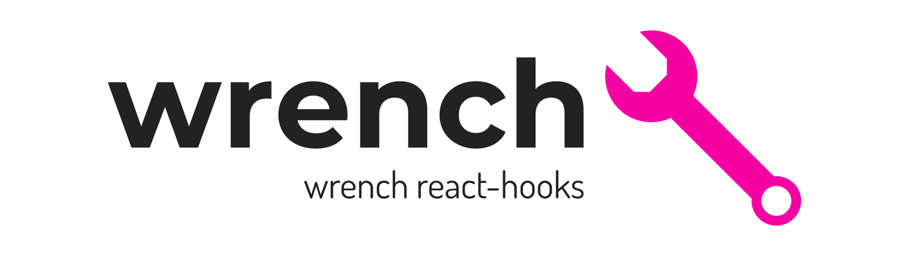

# About

wrench-hooks 扳手 hooks 工具库，针对<span >业务场景</span>开发的 hooks，轻量简洁~~~ (该库支持 TS 类型支持)

<p align="center">
  <a href="https://www.npmjs.com/package/wrench-hooks" title="npm">
    
  </a>
   <a href="https://badge.fury.io/js/wrench-hooks" title="npm">
    
  </a>
  <a href="https://isitmaintained.com/project/wrench-hooks/wrench-hooks">
    
  </a>
  <a href="https://github.com/wrench-hooks/wrench-hooks">
    
  </a>
</p>

## Quick Start

```sh
npm i wrench-hooks
```

```js
import { useTitle } from 'wrench-hooks'

useTitle('welcome to  wrench-hooks')
```

## Docs

[document address](https://ccj-007.github.io/wrench-hooks/storybook-static/index)

## API

| hooks                | description                                       |
| -------------------- | ------------------------------------------------- |
| createMemo           | useMemo 的封装, 自动收集函数依赖的缓存钩子        |
| createReducer        | 结合 thunk、logger 中间件的 useReducer            |
| createReducerContext | useReducer 结合 createContext 实现组件状态共享    |
| createStateContext   | useState 结合 createContext 实现组件状态共享      |
| useCallbackState     | 用于获取最新的 state                              |
| useUpdate            | 强制更新钩子                                      |
| useFirstMountState   | 是否第一次渲染                                    |
| useUpdateEffect      | 忽略第一次调用钩子的 useEffect 的 update 更新状态 |
| useDebounce          | 常见用于 input 的输入控制 state 的防抖处理        |
| useThrottle          | 按钮点击必用的控制 state 的节流处理               |
| useMouse             | 跟踪鼠标的位置                                    |
| useScroll            | 跟踪网页滚轮的位置                                |
| useWindowSize        | 跟踪网页的尺寸缩放                                |
| useFullScreen        | 全局显示元素或视频                                |
| useClip              | 文本复制到剪贴板                                  |
| useTitle             | 修改标题                                          |
| useClickOutside      | 点击 DOM 外部区域的回调                           |
